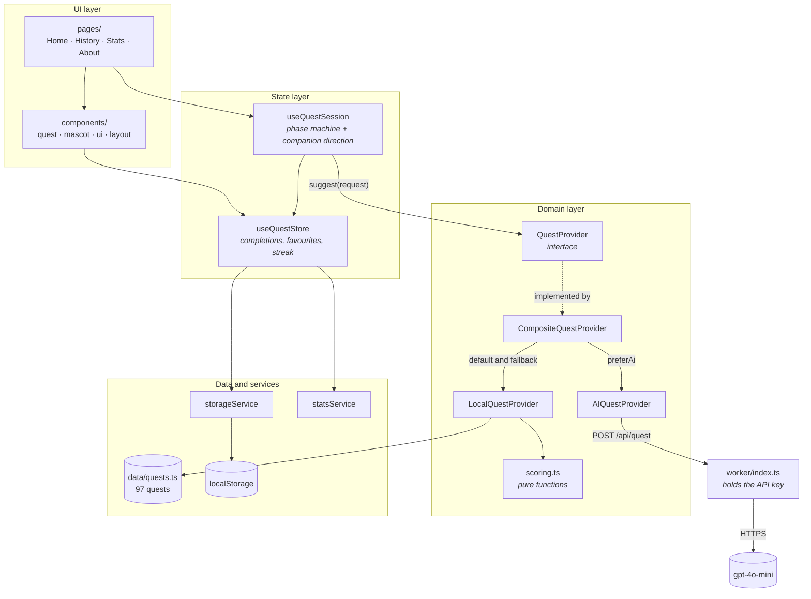

# SideQuest

**For the moments when you want to do something but cannot decide what.**

Tell SideQuest how long you have, what mood you are in, where you are and how far you want to take
it. It gives you **one** thing to do. Not a list, not a feed, not twelve options to deliberate over.
Accept it, or ask for another.

**[sidequest.danishelahi.com](https://sidequest.danishelahi.com)**

---

## Contents

- [Why it exists](#why-it-exists)
- [Features](#features)
- [Architecture](#architecture)
- [Recommendation engine](#recommendation-engine)
- [The companion](#the-companion)
- [AI quests](#ai-quests)
- [Accessibility](#accessibility)
- [Tech stack](#tech-stack)
- [Running locally](#running-locally)
- [Deployment](#deployment)
- [Roadmap](#roadmap)

## Why it exists

Every "things to do when bored" app has the same two problems.

**The first is that they give you a list.** A list is the original decision again with extra steps.
The thing you could not do was choose, and thirty options does not help with that. SideQuest shows
exactly one quest at a time. There is a button to reject it, but there is never a menu to browse.

**The second is that the suggestions are filler.** "Read a book." "Go for a walk." "Watch a movie."
Nobody has ever been rescued from boredom by being told to go for a walk. So all 97 quests in the
catalogue are written by hand and each has to pass one test: is this specific enough that you could
start it in the next sixty seconds? "Read a book" fails. "Take an unread book off the shelf, read
its final page first, then decide whether you still want the other three hundred" passes.

## Features

**The core loop**

- One quest at a time, matched to your time, mood, location and appetite for chaos.
- **Surprise Me** skips the questionnaire and draws instantly.
- 97 hand-written quests across 10 categories.
- A full lifecycle: preview, accept, complete or abandon. An accepted quest survives a page reload.
- An optional completion check ("Did you actually do it?") before a quest counts, because a streak
  you did not earn makes the whole thing meaningless. On by default, switchable off in Stats.
- History with favourites, and stats with streaks. Four numbers, no dashboard.

**The companion**

- Its body language matches what it says. Every line is stored with the pose that delivers it, so
  "Again?!" arrives with its arms thrown up rather than a placid bob.
- It gets visibly frustrated, then does something about it. Reject enough suggestions and mild
  irritation becomes a real outburst, after which it stops suggesting and asks you a question whose
  answers actually do something.
- It has patience and you can run it out. Keep poking and the replies shorten the way a real
  person's do, until it walks off and turns its back. Leave it alone and it cools down on its own.

**Everything else**

- Optional AI-generated quests, with the catalogue as an instant, free, always-available fallback.
- Light and dark themes, with no flash of the wrong one on load.
- No account, no analytics, no tracking. Everything lives in `localStorage`.
- Respects `prefers-reduced-motion` throughout.

## Architecture



### The provider seam

The important line in that diagram is `session -->|suggest(request)| provider`. **No component ever
imports a concrete provider.** The UI depends on the `QuestProvider` interface, and one file,
`src/engine/index.ts`, decides which implementation satisfies it:

```ts
export const questProvider: QuestProvider = new CompositeQuestProvider(
  new LocalQuestProvider(),
  new AIQuestProvider(),
);
```

`suggest()` returns a `Promise` even though the local implementation is entirely synchronous. That
is the one concession the design made to a future that did not exist yet, and it paid off: every
loading state, race guard and error path in the UI was already written for an async call, so adding
the AI provider later touched this file and nothing else.

### Folder structure

```
src/
  components/   quest/ · mascot/ · ui/ · layout/
  pages/        one file per route
  hooks/        useQuestStore · useQuestSession · useTheme
                useElementWidth · useScrollTop
  engine/       localQuestProvider · aiQuestProvider · scoring
  services/     storageService · statsService · companionMood
  data/         quests.ts · mascotReactions.ts
  types/        quest · provider · stats · mascot
  utils/        format · random

server/           generateQuest.ts, shared by both adapters below
worker/index.ts   Cloudflare Worker: routes /api/quest, serves dist
api/quest.ts      Vercel adapter
```

A rough rule: `engine/` and `services/` contain no React, `components/` contain no business logic,
and `hooks/` is the only place the two meet.

## Recommendation engine

Given a request (`preferences`, `recentIds`, `completedIds`), `LocalQuestProvider` runs three stages.

**1. Filter on real constraints.** You cannot do a 60-minute quest in 10 minutes, and "go outside"
is not a valid answer to "I am at my computer". Time and context therefore filter rather than score.
If a narrow combination empties the pool it relaxes context first, then time, rather than telling a
bored person there is nothing to do.

**2. Score what is left.**

| Signal | Weight | Reasoning |
| --- | ---: | --- |
| Mood match | +30 | The strongest single predictor of whether you will actually do it |
| Difficulty exact | +26 | You asked for unhinged, you should get unhinged |
| Difficulty adjacent | +11 | Near misses stay eligible so the pool does not collapse |
| Context exact | +20 | Preferred over a quest that merely works anywhere |
| Context "anywhere" | +13 | Always viable, never the most interesting answer |
| Time fit | up to +22 | Scaled by how much of your time it uses. A 10-minute quest is a poor answer to "I have two hours" |
| Recently shown | -60 | Effectively a ban without being a hard exclusion |
| Already completed | -14 | Discouraged, not forbidden. Some quests are worth repeating |
| Jitter | up to +9 | Stops identical inputs producing identical output |

**3. Draw from a shortlist.** Rather than returning the top-scoring quest it takes the top 6 and
picks one with rank-weighted randomness. Strict ranking would make "Give Me Another" walk down the
same list in the same order every time, which feels like a database query. Weighted sampling feels
like someone is thinking.

Surprise Me skips all of this. With no preferences the only rule is "not one you just saw", with a
mild bias towards quests you have never finished.

The functions in `engine/scoring.ts` are pure and take their inputs explicitly, so they can be
tested without React, storage or a DOM.

### Why the search is slower than it needs to be

`LocalQuestProvider` returns in well under a millisecond. The UI holds the result for **1.75s** on a
first draw and 1.15s on a redraw, and that number is in the code on purpose.

An answer that appears instantly reads as a lookup, and a lookup invites you to reject it because
nothing was spent producing it. So the wait is filled rather than hidden: a reel of real quest
titles cycles on a decelerating timer, the companion paces the length of the page, and the result
lands as an arrival. Same engine, same answer, completely different feeling.

The timings are named constants in `useQuestSession.ts` (`THINKING_MS`, `REDRAW_THINKING_MS`,
`REACTION_MS`), so the pacing is tuned in one place. When a network call replaces the local draw the
artificial delay simply shrinks to absorb it.

## The companion

### The patience model

The companion's annoyance is a **continuous meter**, not a counter, and that is what makes it read
as a person rather than a state machine (`services/companionMood.ts`).

Three properties do the work:

- **One shared meter.** Poking it and rejecting suggestions both feed the same number, so it reacts
  to how you have been behaving overall rather than to one isolated action.
- **Rapid-fire costs more.** Five pokes in five seconds is a different act from five pokes over a
  minute, and people respond to the difference. Disturbances inside a 2.6s window land 1.7x harder.
- **It cools off.** The meter drains over about forty seconds, so walking away really is how you fix
  it. Nobody stays annoyed forever.

The meter maps to five tiers (`patient`, `terse`, `irritated`, `frustrated`, `done`), each with its
own dialogue. Read the ladder top to bottom and it is one conversation going bad: full sentences,
then clipped ones, then a question asked with a full stop instead of a question mark, then silence.
The words run out before the temper does.

At `done` it stops answering, steps away and faces the other way. Recovery uses hysteresis: it does
not return the instant the meter dips below the line, but waits until it has genuinely cooled, then
comes back with a line about it. Snapping from furious to fine reads as a switch. A sulk with a tail
on it reads as a person.

### Why it is flat 2D

Two richer treatments were built and both were reverted. The reasoning is worth recording because it
still holds.

**3D was built and deleted.** A character of the quality this needs is sculpted and rigged by
artists. One assembled in code from primitives (a rounded box, capsules, spheres) is programmer art,
and lighting does not fix that. `three` and `@react-three/fiber` came back out, along with the 224kB
lazy chunk they required.

**Gradient shading was built and reverted too.** Rim light, contact shadow and two catchlights per
eye did genuinely read as more crafted, but they moved the character away from the flat graphic look
the rest of the app is drawn in, and that consistency matters more than one asset looking richer.

So the companion is deliberately flat: solid fills, one soft highlight, a simple contact shadow. The
personality lives in the motion and the writing, which holds up at every size and costs nothing to
render.

## AI quests

Every draw asks a model for a quest that has never existed before, shaped to your exact four
answers, plus one line for the companion to say about it. There is no setting: it is simply how the
app works, and the catalogue sits underneath as the floor.

**The key never reaches the browser.** A static site cannot hold a secret, so the page only ever
talks to its own `/api/quest` endpoint. The server behind it holds the key and calls the provider.
Two adapters ship, `worker/index.ts` for Cloudflare and `api/quest.ts` for Vercel, and both are a
few lines over the same `server/generateQuest.ts`, which is written against `fetch` rather than a
provider SDK so one file runs unchanged on Node and on Workers. The backend has zero dependencies.

**The local engine is the floor, not a degraded mode.** `CompositeQuestProvider` tries the model and
falls back to the catalogue on timeout, rate limit, malformed output, or a missing key:

- A generated quest is validated before it is shown. Unknown category, missing description, or a
  duration longer than the time you said you had, and it is thrown away for a real one.
- With no `OPENAI_API_KEY` set the endpoint returns 503 and every quest comes from the catalogue,
  which is a complete, working app rather than a broken one.
- Generated quests are labelled `· generated` on the card. The user should never have to guess.

**Why the catalogue still exists.** The 97 hand-written quests are instant, free and guaranteed
good, which makes them the right thing to fall back to. A network call can always fail, and a bored
person pressing a button must never see an error, so the catalogue is the floor under every draw
rather than a feature you choose.

**Generated questions** are the more interesting half of the integration. Once you have rejected
enough suggestions, the companion's question is written by the model too. The model writes the question and the
button labels, but every option carries an `action` from a fixed enum
(`redraw | easier | reconfigure | giveUp`) that the client already implements. The model supplies
words, the app owns what the words do. Anything it returns is validated: unknown actions dropped,
duplicates collapsed, fewer than two valid options rejected outright. The hand-written question
shows from the first frame and is swapped only if a valid generated one arrives in time, so the
companion is never left mid-outburst with nothing to say.

**Swapping providers is one file.** `server/generateQuest.ts` owns the endpoint URL, the model id,
the prompts and the response parsing. Nothing else in the codebase knows which provider answered.

## Accessibility

- **Contrast is measured, not eyeballed.** Every text colour clears WCAG AA against its actual
  background in both themes: 4.5:1 for body and label text, 3:1 for large display type. The palette
  was derived by walking each colour's lightness until it cleared the threshold, so hue and
  saturation are unchanged.
- **Touch targets are at least 44x44px** on coarse pointers. The hit area is expanded with a
  pseudo-element so the visual design is unchanged, which matters in a nav bar that is already tight
  on a 320px screen.
- **Every control is a native `button` or `a`**, so the whole app is reachable and operable from
  the keyboard, with a visible focus ring on `:focus-visible`.
- `prefers-reduced-motion` is respected everywhere. The companion still changes expression and pose,
  it just stops moving. Personality survives, the vestibular trigger does not.
- Semantic landmarks (`header`, `nav`, `main`) and labelled controls throughout: `aria-label` on
  icon-only buttons, `aria-pressed` and `aria-checked` on toggles and the questionnaire options.

Two known gaps, both listed in the roadmap: the quest phase changes without an `aria-live`
announcement, and the questionnaire's `radiogroup` is a tab stop per option rather than one stop
with arrow-key navigation.

## Tech stack

| Layer | Choice |
| --- | --- |
| Framework | React 18 with TypeScript in strict mode |
| Build | Vite 5 |
| Styling | Tailwind CSS, themed with CSS custom properties |
| Animation | Framer Motion |
| Companion and logo | Hand-written SVG. No 3D, no Lottie, no image assets |
| Routing | React Router 6 |
| Persistence | `localStorage`, behind a service |
| Backend | One Cloudflare Worker, which also serves the static build |
| AI | OpenAI `gpt-4o-mini`, behind the `QuestProvider` interface |

Four runtime dependencies in total: `react`, `react-dom`, `react-router-dom`, `framer-motion`.

## Running locally

```bash
npm install
npm run dev
```

Then open <http://localhost:5173>.

| Script | Does |
| --- | --- |
| `npm run dev` | Dev server with hot module replacement |
| `npm run build` | Typecheck, then production build to `dist/` |
| `npm run preview` | Serve the production build locally |
| `npm run lint` | ESLint |
| `npm run typecheck` | TypeScript across `src/`, `server/`, `worker/` and `api/` |

## Deployment

The app deploys to Cloudflare as a **Worker with static assets**: `worker/index.ts` answers
`/api/quest` and hands everything else to the built `dist/`.

| Setting | Value |
| --- | --- |
| Build command | `npm run build` |
| Deploy command | `npx wrangler deploy` |
| Output directory | `dist` |

`wrangler.jsonc` is what makes this work, and it must exist. Without a wrangler config, `wrangler
deploy` falls back to framework auto-detection, recognises Vite, and tries to apply the Cloudflare
Vite plugin, which requires Vite 6 or newer. On Vite 5 that fails the build with "The version of
Vite used in the project cannot be automatically configured". Declaring `main` and `assets`
explicitly means wrangler deploys what the file says and never takes that path.

**Client-side routing** is handled by `assets.not_found_handling: "single-page-application"`, so a
deep link such as `/history` gets `index.html` rather than a 404.

**Note on Pages Functions.** A `functions/` directory is a Cloudflare **Pages** convention. It is
read by `wrangler pages deploy` and ignored completely by a Worker deployment, so routing here is
explicit in `worker/index.ts` instead.

**Vercel** is also supported: `api/quest.ts` is an Edge Function over the same `server/` module, and
`vercel.json` provides the SPA rewrite.

**Set `OPENAI_API_KEY`** or every quest comes from the catalogue. On Cloudflare: Workers and Pages,
your project, Settings, Variables and Secrets, added as a **Secret** rather than a plaintext
variable. On Vercel: Project Settings, Environment Variables. For local testing, copy `.env.example`
to `.dev.vars` and run `npx wrangler dev`.

> Never prefix the key with `VITE_`. Anything named `VITE_*` is inlined into the browser bundle and
> would publish your key to every visitor.

> Cloudflare hides the Variables and Secrets panel while a project has no server-side code. If it
> says "Variables cannot be added to a Worker that only has static assets", the deployment has no
> Worker script, so check that `wrangler.jsonc` has `main` set.

## Roadmap

- [ ] **Quest timer**, an optional countdown for time-boxed quests.
- [ ] **Shareable quests**, a `/q/:id` route so you can send someone a specific quest.
- [ ] **A real backend** serving the catalogue, so quests can be added without a redeploy.
- [ ] **Optional accounts** to sync history across devices. Strictly optional: the app must keep
      working with no account at all.
- [ ] **Community submissions**, with moderation, because the whole product rests on quest quality.
- [ ] **`aria-live` on the quest region**, so a screen reader hears the result of a search.
- [ ] **Arrow-key navigation** inside the questionnaire's `radiogroup`.

## Credits

Built by **[Danish Elahi](https://danishelahi.com)**.

The SideQuest companion and logo are original artwork, drawn as SVG in
`src/components/mascot/` and `src/components/layout/Logo.tsx`.
